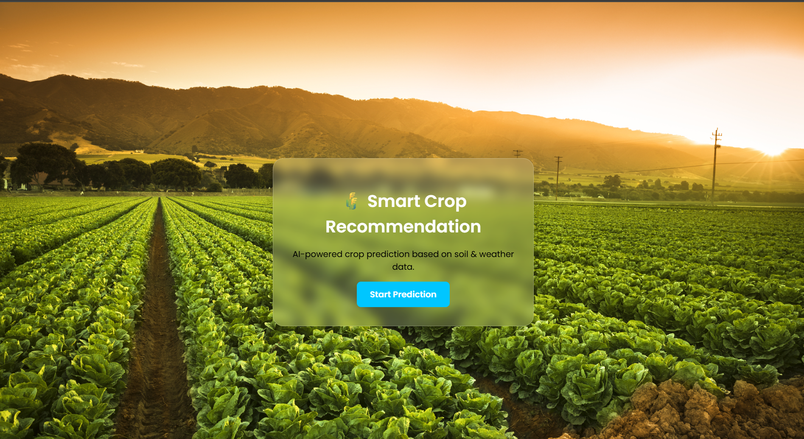
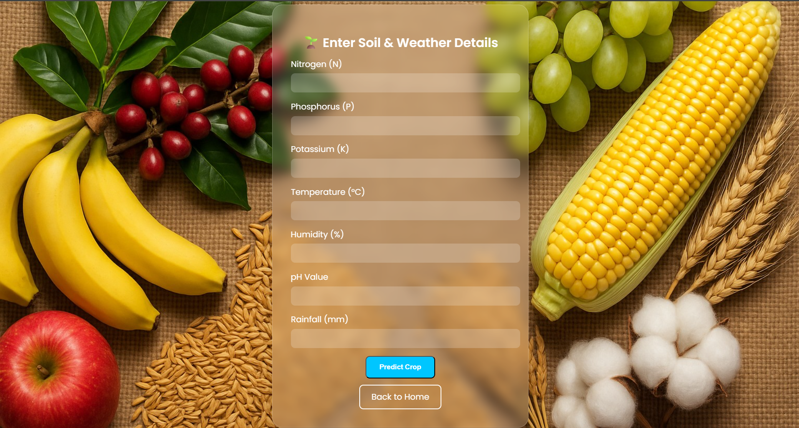
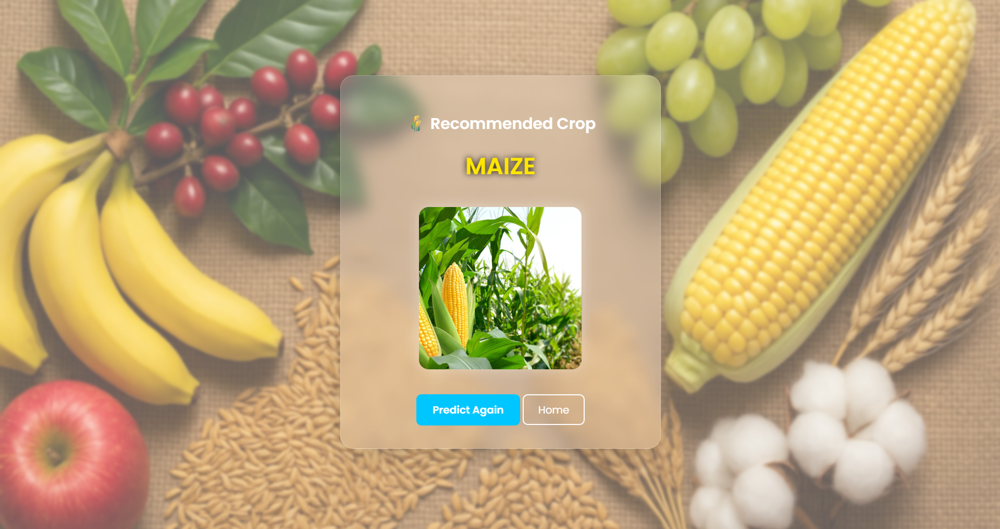

# 🌾 Smart Crop Recommendation Using Environmental and Soil Parameters

A Machine Learning–powered web application that predicts the **most suitable crop** based on soil nutrients (N, P, K), environmental factors (temperature, humidity, rainfall), and soil pH.  
This project aims to support **precision agriculture**, enabling farmers to make data-driven decisions and maximize productivity.

---

## 👥 Group Members

| Name                 | PRN          |
|----------------------|--------------|
| **Shivraj Nalawade** | 202301060008 |
| **Pritesh Purkar**   | 202301060010 |
| **Prajakta More**    | 202301060012 |
| **Harshal Devkate**  | 202401060016 |

---

## 🚀 Features

- ✔️ Predicts the best crop using 7 key environmental & soil features  
- ✔️ ML model trained on the **Crop Recommendation Dataset (Kaggle)**  
- ✔️ User-friendly web interface built with **Flask**  
- ✔️ Displays crop image and name after prediction  
- ✔️ Input validation to avoid incorrect predictions  
- ✔️ Ready for deployment (Render / Streamlit / local server)

---

## 📌 Technologies Used

### **🔹 Frontend**
- HTML5  
- CSS3  
- Bootstrap  
- Custom UI styling  

### **🔹 Backend**
- Python  
- Flask  
- NumPy  
- Pandas  
- Scikit-learn  
- Joblib  

### **🔹 Model**
- Random Forest Classifier   
- Label Encoding for crop names  
- Trained using 7 features from the dataset  

---

## 📊 Input Parameters

| Parameter | Description |
|----------|-------------|
| N | Nitrogen content in soil |
| P | Phosphorus content |
| K | Potassium content |
| Temperature | °C |
| Humidity | % |
| pH | Soil acidity/alkalinity |
| Rainfall | mm |

---

## 🧠 How It Works

1. User enters soil and environmental values in the form  
2. Inputs are validated to stay within realistic limits  
3. Model predicts the best crop  
4. Crop name and its image are displayed on the result page  

The prediction pipeline is:

---

##

📸 Project Output – Website Pages (RESULTS)

Below are the final UI pages of our Smart Crop Recommendation System, attached as project results.

🏠 1. Home Page (welcome.html)

This is the landing page of the application with a clean background and a "Start Prediction" button.

📷 Screenshot:

📊 2. Prediction Page (index.html)

This page collects environmental and soil parameter values from the user.

📷 Screenshot:

🌱 3. Result Page (result.html)

Displays the predicted crop along with the crop image and options to return to home or predict again.

📷 Screenshot:

---

## Live Demo

https://crop-recommendation-6-t9ah.onrender.com

---